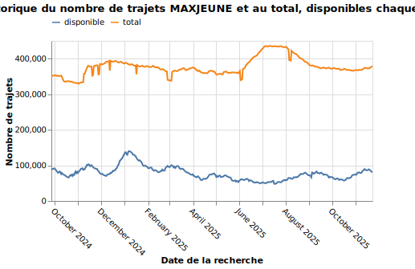

# max-stats

Les disponibilité de places [MAXJEUNE](https://ressources.data.sncf.com/explore/dataset/tgvmax/information/) dans les 30 jours sont 
renouvellées tous les jours par la SNCF MAIS les anciennes données ne sont pas accessibles.
Ce dépot sauvegarde les [données](https://ressources.data.sncf.com/api/explore/v2.1/catalog/datasets/tgvmax/exports/csv) tous les jours à **22h22**.
 
Ce jeu de données archive **417 jours** de requêtes du **2024-09-26** au **2025-11-16**. Il manque **0 jours**. 

## Format

Les données sont téléchargées au format csv, transformées au format parquet, puis enregistrées dans le dossier `data/maxjeune`.
La description des champs de données est consultable sur la [page](https://ressources.data.sncf.com/explore/dataset/tgvmax/information/) du jeu de données.

Chaque jour les données sont sauvegardées dans le fichier `data/maxjeune/{id}.pq`. 
Le numéro de dans le nom du fichier n'a pas de sens particulier et est incrémenté chaque jour.

## Réutilisation 
Les données sont produites par la SNCF, la license est indiquée sur la [page](https://ressources.data.sncf.com/explore/dataset/tgvmax/information/) du jeu de données.
Vous en faites ce que vous voulez.

## TODO

- [x] Convertir les anciennes données en format parquet
- [x] Retirer les artefacts de scrapy dans les anciennes données (colonnes "_key" et "_type")
- [x] Ajouter les anciennes données dans le dépot
- [ ] Ajouter un calcul de différences avec le jour précédent dans `download-maxjeune` pour que la CI échoue si on retélécharge les mêmes donnée
- [x] Automatiquement mettre à jour le readme avec le nombre de jours scrapés et le nombre de jours maquant
- [ ] Automatiquement mettre à jour le readme avec un graphe qui indique le nombre de trajets disponibles dans les 30 prochains jours pour chaque jour de requête (si facile, sous forme de carte animée ?).